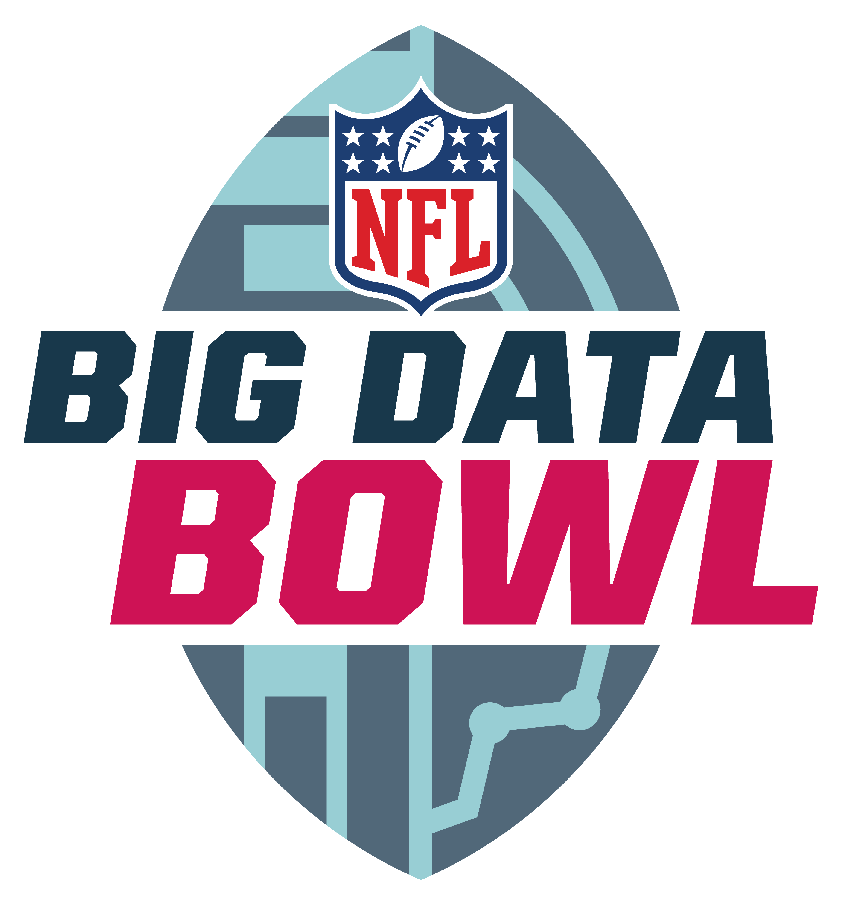

# The Components of a Tackle: A Physics Driven Study 

## Authors

| Name             | Twitter/X                                                                                                                                                                     | GitHub                                                                                               |
| ---------------- | ----------------------------------------------------------------------------------------------------------------------------------------------------------------------------- | ---------------------------------------------------------------------------------------------------- |
| Steven Patton    |  |      |
| Bruno Mioto      |              |  |
| Joseph Armstrong |  |        |

[comment]: <Completely finalized submission is either placed here, or linked to here>

## Submission

Click the following link to view our official submission for the 2024 NFL Big Data Bowl competition:

## References

To view a list of references used for this project [click here](https://github.com/armstjc/big-data-bowl-2024/blob/main/References.md) to go directly to that page.
